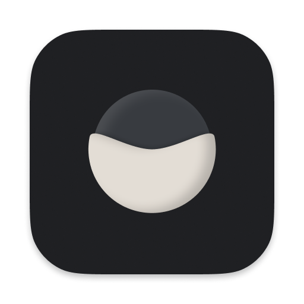

	
	<h2 align="center">Radio CLI PWA</h2>

Radio CLIP is a PWA that can be used to listening to music and keep the illusion that you are in a Terminal.

	<a href="https://google.com">Live demo</a>

	<!--  -->

## Features

- [x] ✨ Fluffless PWA using Next 12
- [ ] 🌗 Lovely night/day themes
- [ ] 🦄 Fully Responsive
- [ ] 📱 Native-like mobile experience
- [ ] 📦 Create more commands

## Getting started

1. [Use this template](https://github.com/mvllow/next-pwa-template/generate)
2. Replace `public/images` with your own
3. Enjoy ✨

## Gallery

### Desktop

<!--  -->

### Mobile

<!--  -->
